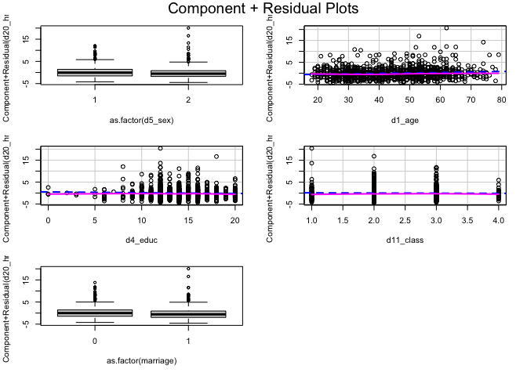


<button id="toc-toggle"><i class="fa-solid fa-bars"></i></button>
1. TOC
{:toc}

    library(haven)
    library(tidyverse)
    library(pander)
    library(dplyr)
    rm(list=ls())

**Use ‘Q19.sav’ dataset in R. For every step, explain the output and
summarize inferences based on the results obtained.**

    data <- read_sav("Q19.sav")

**(1) Many people have suggested that Americans have less than 10 hrs
per day to relax. Using the dataset provided test this statement using
appropriate statistical test.**

H0: Americans have more than 10 hrs per day to relax.

Ha: Americans have less than 10 hrs per day to relax.

    data_1 <- data %>% 
      select("d20_hrsrelax") %>% 
      na.omit()
    t.test(data_1$d20_hrsrelax, alternative="less", mu=10)

    ## 
    ##  One Sample t-test
    ## 
    ## data:  data_1$d20_hrsrelax
    ## t = -86.821, df = 1232, p-value < 2.2e-16
    ## alternative hypothesis: true mean is less than 10
    ## 95 percent confidence interval:
    ##      -Inf 3.734231
    ## sample estimates:
    ## mean of x 
    ##  3.613139

Based on the p-value (&lt;0.05) we can reject the null hypothesis that
the true mean is more than 10 hours. So we can conclude that Americans
have less than 10 hrs per day to relax.

**(2) Also, test if there is a difference in number of hours per day to
relax among men and women.**

H0: There is no difference in number of hours per day to relax among men
and women.

Ha: There is a difference in number of hours per day to relax among men
and women.

Based on the p value (&lt;0.05) we can reject the null hypothesis. So we
can conclude that there is a difference in number of hours per day to
relax among men and women.

\*\*(3) Assume you are interested in understanding the relationship
between hours per day they have to relax (dependent variable), age,
gender (male/female), years of education (highest year of school
completed), social class, and marital status (Married vs Not Married\*).
Run appropriate statistical tests and prepare a summary report that
includes:\*\*

-   Research question

-   Description of the variables

-   Appropriate statistical tests

-   Appropriate diagnostic tests

-   Summary of your findings

**Research question**

What is the relationship among all these variables? How these
independent variables impact the dependent variable?

## Description of the variables

    unique(data$d10_marital)

    ## <labelled<double>[6]>: MARITAL STATUS
    ## [1]  3  1  5  4  2 NA
    ## 
    ## Labels:

    data_3 <- data %>% 
      na.omit() %>% 
      mutate(marriage = case_when(d10_marital == 1 ~ "1", d10_marital == 4 ~ "1", TRUE ~ "0" )) %>% 
      select(-d10_marital)
    names(data_3)

    ## [1] "d20_hrsrelax" "d5_sex"       "d1_age"       "d4_educ"      "d11_class"    "marriage"

    pander(psych::describe(data_3))

<table>
<caption>Table continues below</caption>
<colgroup>
<col style="width: 24%" />
<col style="width: 8%" />
<col style="width: 8%" />
<col style="width: 10%" />
<col style="width: 11%" />
<col style="width: 11%" />
<col style="width: 12%" />
<col style="width: 12%" />
</colgroup>
<thead>
<tr class="header">
<th style="text-align: center;"> </th>
<th style="text-align: center;">vars</th>
<th style="text-align: center;">n</th>
<th style="text-align: center;">mean</th>
<th style="text-align: center;">sd</th>
<th style="text-align: center;">median</th>
<th style="text-align: center;">trimmed</th>
<th style="text-align: center;">mad</th>
</tr>
</thead>
<tbody>
<tr class="odd">
<td style="text-align: center;"><strong>d20_hrsrelax</strong></td>
<td style="text-align: center;">1</td>
<td style="text-align: center;">1223</td>
<td style="text-align: center;">3.618</td>
<td style="text-align: center;">2.588</td>
<td style="text-align: center;">3</td>
<td style="text-align: center;">3.346</td>
<td style="text-align: center;">1.483</td>
</tr>
<tr class="even">
<td style="text-align: center;"><strong>d5_sex</strong></td>
<td style="text-align: center;">2</td>
<td style="text-align: center;">1223</td>
<td style="text-align: center;">1.511</td>
<td style="text-align: center;">0.5001</td>
<td style="text-align: center;">2</td>
<td style="text-align: center;">1.514</td>
<td style="text-align: center;">0</td>
</tr>
<tr class="odd">
<td style="text-align: center;"><strong>d1_age</strong></td>
<td style="text-align: center;">3</td>
<td style="text-align: center;">1223</td>
<td style="text-align: center;">44.11</td>
<td style="text-align: center;">13.43</td>
<td style="text-align: center;">44</td>
<td style="text-align: center;">43.89</td>
<td style="text-align: center;">16.31</td>
</tr>
<tr class="even">
<td style="text-align: center;"><strong>d4_educ</strong></td>
<td style="text-align: center;">4</td>
<td style="text-align: center;">1223</td>
<td style="text-align: center;">14.05</td>
<td style="text-align: center;">2.927</td>
<td style="text-align: center;">14</td>
<td style="text-align: center;">14.06</td>
<td style="text-align: center;">2.965</td>
</tr>
<tr class="odd">
<td style="text-align: center;"><strong>d11_class</strong></td>
<td style="text-align: center;">5</td>
<td style="text-align: center;">1223</td>
<td style="text-align: center;">2.404</td>
<td style="text-align: center;">0.6283</td>
<td style="text-align: center;">2</td>
<td style="text-align: center;">2.409</td>
<td style="text-align: center;">0</td>
</tr>
<tr class="even">
<td style="text-align: center;"><strong>marriage</strong>*</td>
<td style="text-align: center;">6</td>
<td style="text-align: center;">1223</td>
<td style="text-align: center;">1.512</td>
<td style="text-align: center;">0.5001</td>
<td style="text-align: center;">2</td>
<td style="text-align: center;">1.515</td>
<td style="text-align: center;">0</td>
</tr>
</tbody>
</table>

Table continues below

<table>
<colgroup>
<col style="width: 26%" />
<col style="width: 8%" />
<col style="width: 8%" />
<col style="width: 11%" />
<col style="width: 15%" />
<col style="width: 15%" />
<col style="width: 15%" />
</colgroup>
<thead>
<tr class="header">
<th style="text-align: center;"> </th>
<th style="text-align: center;">min</th>
<th style="text-align: center;">max</th>
<th style="text-align: center;">range</th>
<th style="text-align: center;">skew</th>
<th style="text-align: center;">kurtosis</th>
<th style="text-align: center;">se</th>
</tr>
</thead>
<tbody>
<tr class="odd">
<td style="text-align: center;"><strong>d20_hrsrelax</strong></td>
<td style="text-align: center;">0</td>
<td style="text-align: center;">24</td>
<td style="text-align: center;">24</td>
<td style="text-align: center;">1.904</td>
<td style="text-align: center;">7.496</td>
<td style="text-align: center;">0.07399</td>
</tr>
<tr class="even">
<td style="text-align: center;"><strong>d5_sex</strong></td>
<td style="text-align: center;">1</td>
<td style="text-align: center;">2</td>
<td style="text-align: center;">1</td>
<td style="text-align: center;">-0.04411</td>
<td style="text-align: center;">-2</td>
<td style="text-align: center;">0.0143</td>
</tr>
<tr class="odd">
<td style="text-align: center;"><strong>d1_age</strong></td>
<td style="text-align: center;">18</td>
<td style="text-align: center;">79</td>
<td style="text-align: center;">61</td>
<td style="text-align: center;">0.1213</td>
<td style="text-align: center;">-0.8892</td>
<td style="text-align: center;">0.3839</td>
</tr>
<tr class="even">
<td style="text-align: center;"><strong>d4_educ</strong></td>
<td style="text-align: center;">0</td>
<td style="text-align: center;">20</td>
<td style="text-align: center;">20</td>
<td style="text-align: center;">-0.4199</td>
<td style="text-align: center;">1.794</td>
<td style="text-align: center;">0.08368</td>
</tr>
<tr class="odd">
<td style="text-align: center;"><strong>d11_class</strong></td>
<td style="text-align: center;">1</td>
<td style="text-align: center;">4</td>
<td style="text-align: center;">3</td>
<td style="text-align: center;">0.08822</td>
<td style="text-align: center;">-0.2204</td>
<td style="text-align: center;">0.01797</td>
</tr>
<tr class="even">
<td style="text-align: center;"><strong>marriage</strong>*</td>
<td style="text-align: center;">1</td>
<td style="text-align: center;">2</td>
<td style="text-align: center;">1</td>
<td style="text-align: center;">-0.04738</td>
<td style="text-align: center;">-1.999</td>
<td style="text-align: center;">0.0143</td>
</tr>
</tbody>
</table>

-   Variable “d20\_hrsrelax\*” means the hours of relaxation. It’s a
    interval-ratio variable. Min = 0, Max = 24, Means = 3.6, SD = 2.588,
    Range = 24.

-   Variable “d5\_sex” means response’s gender. It’s a nominal variable.
    Value 1 is male and 2 is female.

-   Variable “d1\_age” means response’s age. It’s a interval-ratio
    variable. Min = 18, Max = 79, Means = 44.1, SD = 13.43, Range = 61.

-   Variable “d4\_educ” means response’s years of education. It’s a
    interval-ratio variable. Min = 0, Max = 20, Means = 14.05, SD =
    2.93, Range = 20.

-   Variable “d11\_class” means response’s subjective class
    identification. It’s a ordinal variable. The range is 3 and the SD
    is 0.63. Max = 4, Min = 1.

-   Variable “marriage” means response’s marriage status. It’s a nominal
    variable. 0 means not married and 1 means married.

**Statistical tests**

    pander(Hmisc::rcorr(as.matrix(data_3), type = "pearson"),split.tables=Inf)

    ## Registered S3 method overwritten by 'htmlwidgets':
    ##   method           from         
    ##   print.htmlwidget tools:rstudio

    ## Registered S3 method overwritten by 'data.table':
    ##   method           from
    ##   print.data.table

-   **r**:

    <table>
    <caption>Table continues below</caption>
    <colgroup>
    <col style="width: 23%" />
    <col style="width: 18%" />
    <col style="width: 14%" />
    <col style="width: 14%" />
    <col style="width: 13%" />
    <col style="width: 14%" />
    </colgroup>
    <thead>
    <tr class="header">
    <th style="text-align: center;"> </th>
    <th style="text-align: center;">d20_hrsrelax</th>
    <th style="text-align: center;">d5_sex</th>
    <th style="text-align: center;">d1_age</th>
    <th style="text-align: center;">d4_educ</th>
    <th style="text-align: center;">d11_class</th>
    </tr>
    </thead>
    <tbody>
    <tr class="odd">
    <td style="text-align: center;"><strong>d20_hrsrelax</strong></td>
    <td style="text-align: center;">1</td>
    <td style="text-align: center;">-0.09128</td>
    <td style="text-align: center;">0.09238</td>
    <td style="text-align: center;">-0.05673</td>
    <td style="text-align: center;">-0.02233</td>
    </tr>
    <tr class="even">
    <td style="text-align: center;"><strong>d5_sex</strong></td>
    <td style="text-align: center;">-0.09128</td>
    <td style="text-align: center;">1</td>
    <td style="text-align: center;">-0.008959</td>
    <td style="text-align: center;">0.02729</td>
    <td style="text-align: center;">-0.09233</td>
    </tr>
    <tr class="odd">
    <td style="text-align: center;"><strong>d1_age</strong></td>
    <td style="text-align: center;">0.09238</td>
    <td style="text-align: center;">-0.008959</td>
    <td style="text-align: center;">1</td>
    <td style="text-align: center;">0.03372</td>
    <td style="text-align: center;">0.1528</td>
    </tr>
    <tr class="even">
    <td style="text-align: center;"><strong>d4_educ</strong></td>
    <td style="text-align: center;">-0.05673</td>
    <td style="text-align: center;">0.02729</td>
    <td style="text-align: center;">0.03372</td>
    <td style="text-align: center;">1</td>
    <td style="text-align: center;">0.3745</td>
    </tr>
    <tr class="odd">
    <td style="text-align: center;"><strong>d11_class</strong></td>
    <td style="text-align: center;">-0.02233</td>
    <td style="text-align: center;">-0.09233</td>
    <td style="text-align: center;">0.1528</td>
    <td style="text-align: center;">0.3745</td>
    <td style="text-align: center;">1</td>
    </tr>
    <tr class="even">
    <td style="text-align: center;"><strong>marriage</strong></td>
    <td style="text-align: center;">-0.0765</td>
    <td style="text-align: center;">-0.05861</td>
    <td style="text-align: center;">0.1762</td>
    <td style="text-align: center;">0.1011</td>
    <td style="text-align: center;">0.1462</td>
    </tr>
    </tbody>
    </table>

    Table continues below

    <table style="width:42%;">
    <colgroup>
    <col style="width: 26%" />
    <col style="width: 15%" />
    </colgroup>
    <thead>
    <tr class="header">
    <th style="text-align: center;"> </th>
    <th style="text-align: center;">marriage</th>
    </tr>
    </thead>
    <tbody>
    <tr class="odd">
    <td style="text-align: center;"><strong>d20_hrsrelax</strong></td>
    <td style="text-align: center;">-0.0765</td>
    </tr>
    <tr class="even">
    <td style="text-align: center;"><strong>d5_sex</strong></td>
    <td style="text-align: center;">-0.05861</td>
    </tr>
    <tr class="odd">
    <td style="text-align: center;"><strong>d1_age</strong></td>
    <td style="text-align: center;">0.1762</td>
    </tr>
    <tr class="even">
    <td style="text-align: center;"><strong>d4_educ</strong></td>
    <td style="text-align: center;">0.1011</td>
    </tr>
    <tr class="odd">
    <td style="text-align: center;"><strong>d11_class</strong></td>
    <td style="text-align: center;">0.1462</td>
    </tr>
    <tr class="even">
    <td style="text-align: center;"><strong>marriage</strong></td>
    <td style="text-align: center;">1</td>
    </tr>
    </tbody>
    </table>

-   **n**:

    <table>
    <colgroup>
    <col style="width: 22%" />
    <col style="width: 17%" />
    <col style="width: 10%" />
    <col style="width: 10%" />
    <col style="width: 11%" />
    <col style="width: 13%" />
    <col style="width: 13%" />
    </colgroup>
    <thead>
    <tr class="header">
    <th style="text-align: center;"> </th>
    <th style="text-align: center;">d20_hrsrelax</th>
    <th style="text-align: center;">d5_sex</th>
    <th style="text-align: center;">d1_age</th>
    <th style="text-align: center;">d4_educ</th>
    <th style="text-align: center;">d11_class</th>
    <th style="text-align: center;">marriage</th>
    </tr>
    </thead>
    <tbody>
    <tr class="odd">
    <td style="text-align: center;"><strong>d20_hrsrelax</strong></td>
    <td style="text-align: center;">1223</td>
    <td style="text-align: center;">1223</td>
    <td style="text-align: center;">1223</td>
    <td style="text-align: center;">1223</td>
    <td style="text-align: center;">1223</td>
    <td style="text-align: center;">1223</td>
    </tr>
    <tr class="even">
    <td style="text-align: center;"><strong>d5_sex</strong></td>
    <td style="text-align: center;">1223</td>
    <td style="text-align: center;">1223</td>
    <td style="text-align: center;">1223</td>
    <td style="text-align: center;">1223</td>
    <td style="text-align: center;">1223</td>
    <td style="text-align: center;">1223</td>
    </tr>
    <tr class="odd">
    <td style="text-align: center;"><strong>d1_age</strong></td>
    <td style="text-align: center;">1223</td>
    <td style="text-align: center;">1223</td>
    <td style="text-align: center;">1223</td>
    <td style="text-align: center;">1223</td>
    <td style="text-align: center;">1223</td>
    <td style="text-align: center;">1223</td>
    </tr>
    <tr class="even">
    <td style="text-align: center;"><strong>d4_educ</strong></td>
    <td style="text-align: center;">1223</td>
    <td style="text-align: center;">1223</td>
    <td style="text-align: center;">1223</td>
    <td style="text-align: center;">1223</td>
    <td style="text-align: center;">1223</td>
    <td style="text-align: center;">1223</td>
    </tr>
    <tr class="odd">
    <td style="text-align: center;"><strong>d11_class</strong></td>
    <td style="text-align: center;">1223</td>
    <td style="text-align: center;">1223</td>
    <td style="text-align: center;">1223</td>
    <td style="text-align: center;">1223</td>
    <td style="text-align: center;">1223</td>
    <td style="text-align: center;">1223</td>
    </tr>
    <tr class="even">
    <td style="text-align: center;"><strong>marriage</strong></td>
    <td style="text-align: center;">1223</td>
    <td style="text-align: center;">1223</td>
    <td style="text-align: center;">1223</td>
    <td style="text-align: center;">1223</td>
    <td style="text-align: center;">1223</td>
    <td style="text-align: center;">1223</td>
    </tr>
    </tbody>
    </table>

-   **P**:

    <table>
    <caption>Table continues below</caption>
    <colgroup>
    <col style="width: 23%" />
    <col style="width: 18%" />
    <col style="width: 13%" />
    <col style="width: 14%" />
    <col style="width: 14%" />
    <col style="width: 14%" />
    </colgroup>
    <thead>
    <tr class="header">
    <th style="text-align: center;"> </th>
    <th style="text-align: center;">d20_hrsrelax</th>
    <th style="text-align: center;">d5_sex</th>
    <th style="text-align: center;">d1_age</th>
    <th style="text-align: center;">d4_educ</th>
    <th style="text-align: center;">d11_class</th>
    </tr>
    </thead>
    <tbody>
    <tr class="odd">
    <td style="text-align: center;"><strong>d20_hrsrelax</strong></td>
    <td style="text-align: center;">NA</td>
    <td style="text-align: center;">0.001395</td>
    <td style="text-align: center;">0.001219</td>
    <td style="text-align: center;">0.04733</td>
    <td style="text-align: center;">0.4353</td>
    </tr>
    <tr class="even">
    <td style="text-align: center;"><strong>d5_sex</strong></td>
    <td style="text-align: center;">0.001395</td>
    <td style="text-align: center;">NA</td>
    <td style="text-align: center;">0.7543</td>
    <td style="text-align: center;">0.3403</td>
    <td style="text-align: center;">0.001227</td>
    </tr>
    <tr class="odd">
    <td style="text-align: center;"><strong>d1_age</strong></td>
    <td style="text-align: center;">0.001219</td>
    <td style="text-align: center;">0.7543</td>
    <td style="text-align: center;">NA</td>
    <td style="text-align: center;">0.2387</td>
    <td style="text-align: center;">7.901e-08</td>
    </tr>
    <tr class="even">
    <td style="text-align: center;"><strong>d4_educ</strong></td>
    <td style="text-align: center;">0.04733</td>
    <td style="text-align: center;">0.3403</td>
    <td style="text-align: center;">0.2387</td>
    <td style="text-align: center;">NA</td>
    <td style="text-align: center;">0</td>
    </tr>
    <tr class="odd">
    <td style="text-align: center;"><strong>d11_class</strong></td>
    <td style="text-align: center;">0.4353</td>
    <td style="text-align: center;">0.001227</td>
    <td style="text-align: center;">7.901e-08</td>
    <td style="text-align: center;">0</td>
    <td style="text-align: center;">NA</td>
    </tr>
    <tr class="even">
    <td style="text-align: center;"><strong>marriage</strong></td>
    <td style="text-align: center;">0.007442</td>
    <td style="text-align: center;">0.04043</td>
    <td style="text-align: center;">5.523e-10</td>
    <td style="text-align: center;">0.0003999</td>
    <td style="text-align: center;">2.808e-07</td>
    </tr>
    </tbody>
    </table>

    Table continues below

    <table style="width:43%;">
    <colgroup>
    <col style="width: 26%" />
    <col style="width: 16%" />
    </colgroup>
    <thead>
    <tr class="header">
    <th style="text-align: center;"> </th>
    <th style="text-align: center;">marriage</th>
    </tr>
    </thead>
    <tbody>
    <tr class="odd">
    <td style="text-align: center;"><strong>d20_hrsrelax</strong></td>
    <td style="text-align: center;">0.007442</td>
    </tr>
    <tr class="even">
    <td style="text-align: center;"><strong>d5_sex</strong></td>
    <td style="text-align: center;">0.04043</td>
    </tr>
    <tr class="odd">
    <td style="text-align: center;"><strong>d1_age</strong></td>
    <td style="text-align: center;">5.523e-10</td>
    </tr>
    <tr class="even">
    <td style="text-align: center;"><strong>d4_educ</strong></td>
    <td style="text-align: center;">0.0003999</td>
    </tr>
    <tr class="odd">
    <td style="text-align: center;"><strong>d11_class</strong></td>
    <td style="text-align: center;">2.808e-07</td>
    </tr>
    <tr class="even">
    <td style="text-align: center;"><strong>marriage</strong></td>
    <td style="text-align: center;">NA</td>
    </tr>
    </tbody>
    </table>

-   **type**: pearson

<!-- end of list -->

Hours per day they have to relax = a + b1(sex) + b2(age) + b3(educ) +
b4(class) + b5(marriage)

    model_1 <- lm(d20_hrsrelax ~ as.factor(d5_sex) + d1_age + d4_educ + d11_class + as.factor(marriage), data=data_3)
    pander(summary(model_1))

<table style="width:100%;">
<colgroup>
<col style="width: 36%" />
<col style="width: 15%" />
<col style="width: 17%" />
<col style="width: 13%" />
<col style="width: 16%" />
</colgroup>
<thead>
<tr class="header">
<th style="text-align: center;"> </th>
<th style="text-align: center;">Estimate</th>
<th style="text-align: center;">Std. Error</th>
<th style="text-align: center;">t value</th>
<th style="text-align: center;">Pr(&gt;|t|)</th>
</tr>
</thead>
<tbody>
<tr class="odd">
<td style="text-align: center;"><strong>(Intercept)</strong></td>
<td style="text-align: center;">3.868</td>
<td style="text-align: center;">0.4511</td>
<td style="text-align: center;">8.575</td>
<td style="text-align: center;">2.956e-17</td>
</tr>
<tr class="even">
<td style="text-align: center;"><strong>as.factor(d5_sex)2</strong></td>
<td style="text-align: center;">-0.4993</td>
<td style="text-align: center;">0.1473</td>
<td style="text-align: center;">-3.39</td>
<td style="text-align: center;">0.0007225</td>
</tr>
<tr class="odd">
<td style="text-align: center;"><strong>d1_age</strong></td>
<td style="text-align: center;">0.0217</td>
<td style="text-align: center;">0.005582</td>
<td style="text-align: center;">3.887</td>
<td style="text-align: center;">0.0001069</td>
</tr>
<tr class="even">
<td style="text-align: center;"><strong>d4_educ</strong></td>
<td style="text-align: center;">-0.03635</td>
<td style="text-align: center;">0.02705</td>
<td style="text-align: center;">-1.344</td>
<td style="text-align: center;">0.1792</td>
</tr>
<tr class="odd">
<td style="text-align: center;"><strong>d11_class</strong></td>
<td style="text-align: center;">-0.07885</td>
<td style="text-align: center;">0.1282</td>
<td style="text-align: center;">-0.6151</td>
<td style="text-align: center;">0.5386</td>
</tr>
<tr class="even">
<td
style="text-align: center;"><strong>as.factor(marriage)1</strong></td>
<td style="text-align: center;">-0.4917</td>
<td style="text-align: center;">0.15</td>
<td style="text-align: center;">-3.278</td>
<td style="text-align: center;">0.001076</td>
</tr>
</tbody>
</table>

<table style="width:89%;">
<caption>Fitting linear model: d20_hrsrelax ~ as.factor(d5_sex) + d1_age
+ d4_educ + d11_class + as.factor(marriage)</caption>
<colgroup>
<col style="width: 20%" />
<col style="width: 30%" />
<col style="width: 13%" />
<col style="width: 23%" />
</colgroup>
<thead>
<tr class="header">
<th style="text-align: center;">Observations</th>
<th style="text-align: center;">Residual Std. Error</th>
<th style="text-align: center;"><em>R</em>2</th>
<th style="text-align: center;">Adjusted <em>R</em>2</th>
</tr>
</thead>
<tbody>
<tr class="odd">
<td style="text-align: center;">1223</td>
<td style="text-align: center;">2.555</td>
<td style="text-align: center;">0.02924</td>
<td style="text-align: center;">0.02525</td>
</tr>
</tbody>
</table>

Fitting linear model: d20\_hrsrelax ~ as.factor(d5\_sex) + d1\_age +
d4\_educ + d11\_class + as.factor(marriage)

    pander(lm.beta::lm.beta(model_1))

<table>
<caption>Fitting linear model: d20_hrsrelax ~ as.factor(d5_sex) + d1_age
+ d4_educ + d11_class + as.factor(marriage) (continued below)</caption>
<colgroup>
<col style="width: 35%" />
<col style="width: 14%" />
<col style="width: 19%" />
<col style="width: 17%" />
<col style="width: 13%" />
</colgroup>
<thead>
<tr class="header">
<th style="text-align: center;"> </th>
<th style="text-align: center;">Estimate</th>
<th style="text-align: center;">Standardized</th>
<th style="text-align: center;">Std. Error</th>
<th style="text-align: center;">t value</th>
</tr>
</thead>
<tbody>
<tr class="odd">
<td style="text-align: center;"><strong>(Intercept)</strong></td>
<td style="text-align: center;">3.868</td>
<td style="text-align: center;">NA</td>
<td style="text-align: center;">0.4511</td>
<td style="text-align: center;">8.575</td>
</tr>
<tr class="even">
<td style="text-align: center;"><strong>as.factor(d5_sex)2</strong></td>
<td style="text-align: center;">-0.4993</td>
<td style="text-align: center;">-0.09649</td>
<td style="text-align: center;">0.1473</td>
<td style="text-align: center;">-3.39</td>
</tr>
<tr class="odd">
<td style="text-align: center;"><strong>d1_age</strong></td>
<td style="text-align: center;">0.0217</td>
<td style="text-align: center;">0.1126</td>
<td style="text-align: center;">0.005582</td>
<td style="text-align: center;">3.887</td>
</tr>
<tr class="even">
<td style="text-align: center;"><strong>d4_educ</strong></td>
<td style="text-align: center;">-0.03635</td>
<td style="text-align: center;">-0.04111</td>
<td style="text-align: center;">0.02705</td>
<td style="text-align: center;">-1.344</td>
</tr>
<tr class="odd">
<td style="text-align: center;"><strong>d11_class</strong></td>
<td style="text-align: center;">-0.07885</td>
<td style="text-align: center;">-0.01915</td>
<td style="text-align: center;">0.1282</td>
<td style="text-align: center;">-0.6151</td>
</tr>
<tr class="even">
<td
style="text-align: center;"><strong>as.factor(marriage)1</strong></td>
<td style="text-align: center;">-0.4917</td>
<td style="text-align: center;">-0.09503</td>
<td style="text-align: center;">0.15</td>
<td style="text-align: center;">-3.278</td>
</tr>
</tbody>
</table>

Fitting linear model: d20\_hrsrelax ~ as.factor(d5\_sex) + d1\_age +
d4\_educ + d11\_class + as.factor(marriage) (continued below)

<table style="width:54%;">
<colgroup>
<col style="width: 37%" />
<col style="width: 16%" />
</colgroup>
<thead>
<tr class="header">
<th style="text-align: center;"> </th>
<th style="text-align: center;">Pr(&gt;|t|)</th>
</tr>
</thead>
<tbody>
<tr class="odd">
<td style="text-align: center;"><strong>(Intercept)</strong></td>
<td style="text-align: center;">2.956e-17</td>
</tr>
<tr class="even">
<td style="text-align: center;"><strong>as.factor(d5_sex)2</strong></td>
<td style="text-align: center;">0.0007225</td>
</tr>
<tr class="odd">
<td style="text-align: center;"><strong>d1_age</strong></td>
<td style="text-align: center;">0.0001069</td>
</tr>
<tr class="even">
<td style="text-align: center;"><strong>d4_educ</strong></td>
<td style="text-align: center;">0.1792</td>
</tr>
<tr class="odd">
<td style="text-align: center;"><strong>d11_class</strong></td>
<td style="text-align: center;">0.5386</td>
</tr>
<tr class="even">
<td
style="text-align: center;"><strong>as.factor(marriage)1</strong></td>
<td style="text-align: center;">0.001076</td>
</tr>
</tbody>
</table>

**Diagnostic tests**

-   Check for Influential Data

<!-- -->

    olsrr::ols_plot_cooksd_bar(model_1)

The values above the threshold line will affect the liner regression
model.

-   Test for normality of residuals

<!-- -->

    olsrr::ols_test_normality(model_1)

    ## -----------------------------------------------
    ##        Test             Statistic       pvalue  
    ## -----------------------------------------------
    ## Shapiro-Wilk              0.8837         0.0000 
    ## Kolmogorov-Smirnov        0.0861         0.0000 
    ## Cramer-von Mises         99.9681         0.0000 
    ## Anderson-Darling         21.5855         0.0000 
    ## -----------------------------------------------

Ho: The distribution is normal

All p-values are equal to 0.0000. Hence we can reject the null
hypothesis that the residuals are normally distributes. So the
distribution is not normal.

-   Test for Homoscedasticity

<!-- -->

    olsrr::ols_test_breusch_pagan(model_1)

    ## 
    ##  Breusch Pagan Test for Heteroskedasticity
    ##  -----------------------------------------
    ##  Ho: the variance is constant            
    ##  Ha: the variance is not constant        
    ## 
    ##                   Data                   
    ##  ----------------------------------------
    ##  Response : d20_hrsrelax 
    ##  Variables: fitted values of d20_hrsrelax 
    ## 
    ##          Test Summary           
    ##  -------------------------------
    ##  DF            =    1 
    ##  Chi2          =    41.15709 
    ##  Prob > Chi2   =    1.404725e-10

As p-value is close to 0.0000, the variance is not constant. Hence the
assumption of Homoskedesticity is false.

-   Tests for Multicollinearity

<!-- -->

    olsrr::ols_vif_tol(model_1)

VIF for all variables &lt; 6. Hence, not much correlation among
independent variables.

-   Test for Linearity

<!-- -->

    car::crPlots(model_1)

-   Model Specification Error

Ho: Model has no Omitted variables

Ideally if p&gt;0.05 then no specification error

    lmtest::resettest(model_1, power = 2:3, type = "regressor")

    ## 
    ##  RESET test
    ## 
    ## data:  model_1
    ## RESET = 1.1637, df1 = 6, df2 = 1211, p-value = 0.3233

p-value is more than 0.05 and we can not reject the null hyphothsis.
Hence, the model does not have omitted variables.

-   Issues of Independence

<!-- -->

    lmtest::dwtest(model_1)

    ## 
    ##  Durbin-Watson test
    ## 
    ## data:  model_1
    ## DW = 2.009, p-value = 0.5597
    ## alternative hypothesis: true autocorrelation is greater than 0

p-value &gt; 0.05. Hence, we cannot reject the null hypothesis. This
means that there is no evidence of autocorrelation.

**Summarize findings**

    unique(data_3$d5_sex)

    ## <labelled<double>[2]>: RESPONDENTS SEX
    ## [1] 1 2
    ## 
    ## Labels:

Predicting hours per day they have to relax using percent of age,
gender, years of education, social class, marital status leads to a
reduction in errors by 2%.

Controlling for other variables in the model:

As age increases by 1, the hours per day they have to relax will
increase by 0.02.

As years of education increases by 1, the hours per day they have to
relax will decrease by 0.036.

As social class increases by 1, the hours per day they have to relax
will decrease by 0.078.

Hours per day they have to relax for females is 0.499 lower than that of
males.

Hours per day they have to relax for married persons is 0.492 lower than
that of unmarried persons.

Coefficients of gender, age, marriage status are statistically
significant with p-value &lt; 0.05, Hence we can say with high
confidence that there is a relationship between hours per day they have
to relax and gender, age, marriage status. And all coefficients are not
equal to 0.

Coefficient of social class and years of education are not statistically
significant with p-value &gt; 0.05. Hence we cannot say with high
confidence that there is a relationship between hours per day they have
to relax and social class, years of education.

As we can see that there are many influential data and many assumptions
are false. Meanwhile, from the regression, we can know that the R square
is 0.02, extremely small, so maybe we need to do more next for improving
the model.

