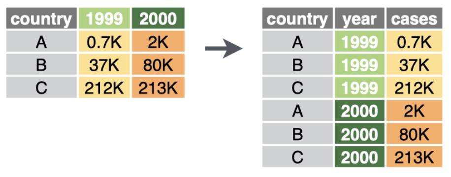
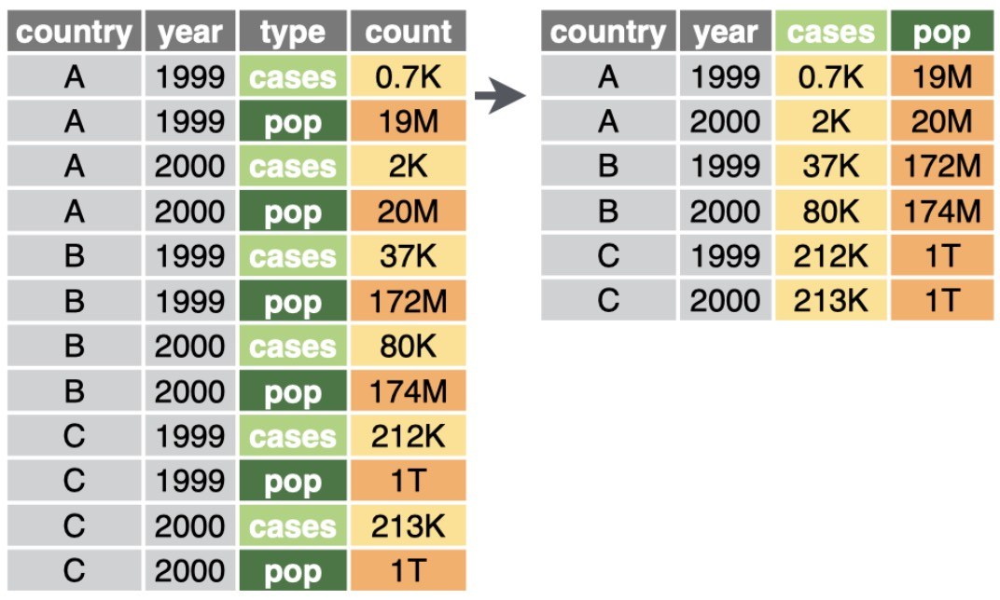
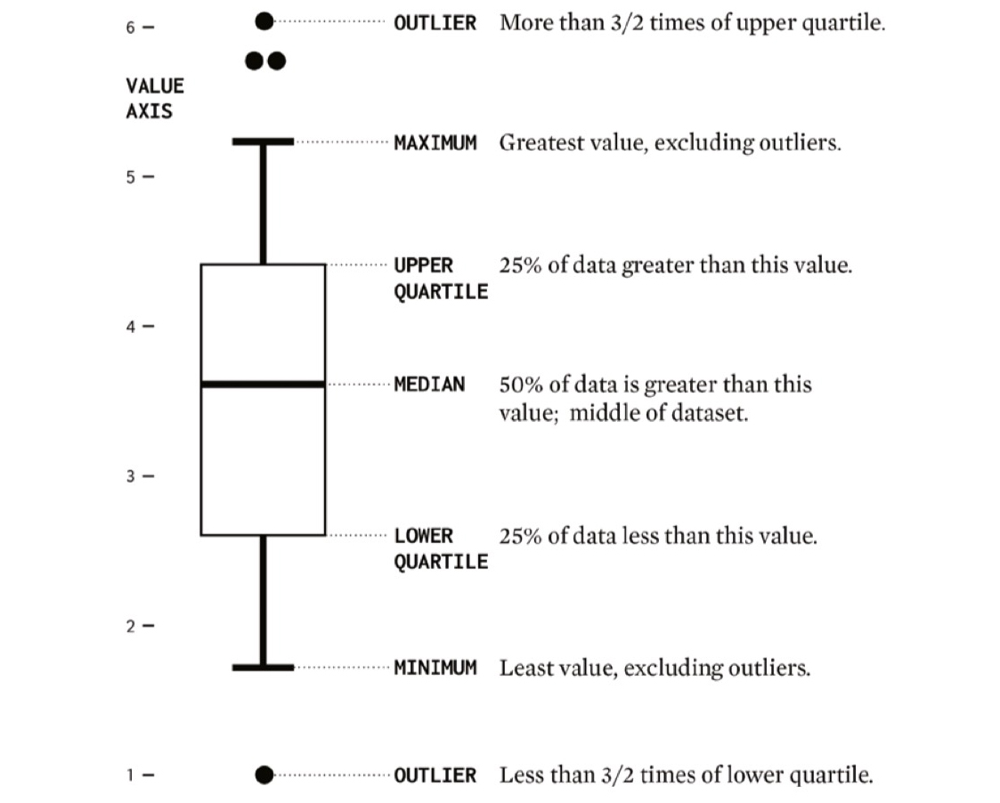

```{r setup, include=FALSE}
knitr::opts_chunk$set(echo = TRUE)
```

---

<!-- start of the main lab content --> 

In lab 3, we are going to explore tidy data, start to visualize data using R, and look at GitHub. The primary dataset we are using is [Zillow Home Value Index (ZHVI)](https://www.zillow.com/research/data/), a measure of the typical home value and market changes across a given region and housing type. More information about what ZHVI is and how it’s calculated is available on [this overview page](https://www.zillow.com/research/methodology-neural-zhvi-32128/). 

The due day for each lab can be found on the [course wesbite](https://www.yuehaoyu.com/data-analytics-visualization/). The submission should include Rmd, html, and any other files required to rerun the codes. **For Lab 1–3, the use of any generative AI tool (ChatGPT, Copilot, etc.) is prohibited**. We will run AI detection on each submission. More information about [Academic Integrity](https://www.yuehaoyu.com/data-analytics-visualization/syllabus/#academic-integrity) and [the Use of AI](https://www.yuehaoyu.com/data-analytics-visualization/syllabus/#use-of-ai).

> **Recommended Reading** <br>
> [Chapter 2, 6, Modern Data Science with R. Baumer et al. 2024.](https://mdsr-book.github.io/mdsr3e) <br>
> [Tidy Data, *The Journal of Statistical Software*, Hadley Wickham, 2014.](https://vita.had.co.nz/papers/tidy-data.html)

---

## Lab 03-A: Tidy Data

```{r message=FALSE}
library('tidyverse')
library('ggplot2') # the major package for visualization in R
```

### Data Preparation 

Instead of using API or R data package as we did in Lab 1 and 2, we will use data on our local device. We have organized the [Zillow Home Value Index (ZHVI)](https://www.zillow.com/research/data/) for the largest 30 [Metropolitan Statistical Ares (MSA)](https://en.wikipedia.org/wiki/Metropolitan_statistical_area) and their 2024 population in csv file `zillow_hvi_msa.csv`. [Comma-separated values (CSV)](https://en.wikipedia.org/wiki/Comma-separated_values) is a text data format that uses commas to separate delimiter-separated values, and newlines to separate records.

```{r}
hvi <- read_csv("zillow_hvi_msa.csv")
```

`CSV` files are just plain text. You can use your text editor (TextEdit on Mac and Notepad on Windows) to have a look. They do not store metadata such as column types, units, or formats. So. when we use `read_csv()`, it automatically guesses column types by inspecting the data. Sometimes its guess is wrong, we need to specify the types using `spec()`.

```{r}
hvi <- read_csv("zillow_hvi_msa.csv",
  col_types = cols(
    RegionName = col_character(),
    StateName  = col_character(),
    Region   = col_character(), # Census Bureau Regions
    RegionID   = col_double(),
    Popu2024   = col_number(),
    .default   = col_double()   # for other columns
  )
)
head(hvi, 3)
```

We will not see the message if we specified the data types. let's have a look of the first 3 rows of this data. The data is ZHVI All Home (SFR, Condo/Co-op) Time Series, Smoothed, Seasonally Adjusted from Zillow Research. The data includes ZHVI for 30 MSA from 2000 to 2025 by month!

Currently, the `hvi` dataset has 30 rows and 312 columns. This presentation of the data has some advantages: we can easily look through the index for single city by date (one row). But, we have 308 columns for house value index, which treated as separate variables now. In data science, researchers defined a particular format of data table: **tidy data** - [A research paper about tidy data](https://www.jstatsoft.org/article/view/v059i10).

### Data Tidying

**This section was adopted from [Tidy data page](https://cran.r-project.org/web/packages/tidyr/vignettes/tidy-data.html), authored by [Hadley Wickham](https://hadley.nz), I believe.**

> Happy families are all alike; every unhappy family is unhappy in its own way — Leo Tolstoy

Like families, tidy datasets are all alike but every messy dataset is messy in its own way. The principles of tidy data provide a standard way to organize data values within a dataset. A standard makes initial data cleaning easier because you don’t need to start from scratch and reinvent the wheel every time. The tidy data standard has been designed to facilitate initial exploration and analysis of the data, and to simplify the development of data analysis tools that work well together. 

#### Data Semantics

A dataset is a collection of **values**, usually either numbers or strings. Values are organised in two ways: every value belongs to a variable and an observation. 

- A **variable** contains all values that measure the same underlying attribute (like height, temperature, duration) across units. 
- An **observation** contains all values measured on the same unit (like a person, or a day, or a race) across attributes.

```{r}
head(hvi, 3)
```

Look at our `hvi` dataset, it contains 9,360 values representing **312** variables and **30** observations. The variables are:

- `RegionID`: a unique regional ID defined by Zillow
- `RegionalName`: the name of 30 MSA
- `Popu2024`: the population of MSA in 2024 based on US Census Bureau
- `StateName`: state name
- 308 columns representing dates: Housing Value Index on that date

A tidy version of the data looks like this: 

```{r}
hvi_tidy <- hvi %>%
  pivot_longer( # using `pivot_longer` to reshape wide → long
    cols = -c("RegionID", "RegionName", "Popu2024", "StateName", "Region"), # keep these 4 as identifier variables (don’t pivot them)
    names_to = "Date",  # old column names (like "1/31/00") become a new column called Date                 
    values_to = "HVI" # the cell values go into a new column called HVI 
    # values_drop_na = TRUE; default as FALSE; if TRUE, will remove rows with missing HVI.
  ) %>%
  mutate(
    Date = as.Date(Date, format = "%m/%d/%y")                   
  )
head(hvi_tidy,3)
```



Look at our `hvi_tidy` dataset again, it contains 9,360 values representing **6** variables and **9,240** observations. The variables are:

- `RegionID`: a unique regional ID defined by Zillow
- `RegionalName`: the name of 30 MSA
- `Popu2024`: the population of MSA in 2024 based on US Census Bureau
- `StateName`: state name
- `Date`: **NEW** - observation date
- `HVI`: **NEW** - Housing Value Index from Zillow

The tidy data frame explicitly tells us the definition of an observation. Every combination of `RegionName` and `Date` is a single measured observation (`HVI`). It's important to clearly define **what is an observation**. In the case of HVI, we are interested in HVI for sure! For an observation, such as `220834.8`, we need know two information: region and date.

#### Tidy data

In tidy data:

- Each variable is a column; each column is a variable.
- Each observation is a row; each row is an observation.
- Each value is a cell; each cell is a single value.

Tidy data makes it easy for an analyst or a computer to extract needed variables because it provides a standard way of structuring a dataset. Tidy data is particularly well suited for vectorised programming languages like R, because the layout ensures that values of different variables from the same observation are always paired. Many R packages, such as `ggplot2` are designed around the tidy data principles.

#### From Tidy Data to Wider Data

We can use `pivot_wider()` to perform the inverse operation. 

```{r}
hvi_wide <- hvi_tidy %>%
  pivot_wider(
    names_from = Date,   # expand `Date` to multiple rows 
    values_from = HVI    # extract`HVI` column to those new columns
  )
head(hvi_wide, 3)
```



### Missing Values

In `pivot_longer`, there is an optional argument called `values_drop_na =`, default as `FALSE`. If setting as `TRUE`, it will remove rows with missing HVI. We set as `FALSE` but is there any `NA` (Not Available) values?

We can use `is.na()` to check and there are 3 missing value in  `HVI` column:

```{r}
colSums(is.na(hvi_tidy))
```

We can remove NA or smooth/impute them based on their neighbors. We will just remove them here because those 3 missing values do not impact too much on our visualization. But, there are many ways you can do data interpolation. It can based on known temporal neighbors, spatial neighbors, group-based neighbors. It goes beyond this course but it's an important problem for data science. If you are interested in missing data, you can refer to this book: [Statistical Analysis with Missing Data](https://onlinelibrary.wiley.com/doi/book/10.1002/9781119482260).

```{r}
# remove NA then we can see there are 9237 rows afterwards, 3 missing values are removed
hvi_tidy_NA_remove <- hvi_tidy %>% 
  filter(!is.na(HVI))
dim(hvi_tidy_NA_remove)
```

#### 📚 TODO: Handle Missing Values

**4 points**

Instead of omitting those missing values, let's try filling missing values in `hvi_tidy` using a [linear interpolation method](https://en.wikipedia.org/wiki/Linear_interpolation). You can use the `zoo` package, which provides a convenient function `na.approx()` for handling time-series data.

[The documentation](https://www.rdocumentation.org/packages/zoo/versions/1.8-14/topics/na.approx) and [this post](https://www.spsanderson.com/steveondata/posts/2024-11-28/) may be helpful to you!

```{r}
# TODO
```

---

## Lab 03-B: Exploratory Data Analysis in R

Starting from this lab session, we are going to conduct data visualization using R and [ggplot2](https://ggplot2.tidyverse.org). You don't have to install `ggplot2` separately because it is already a part of `tidyverse`. 

Exploratory Data Analysis (EDA) is the process of summarizing, visualizing, and checking data to uncover patterns, detect outliers, and identify unexpected features. It helps you understand the structure and quality of your dataset before applying formal statistical models or machine learning methods. The key of EDA is **not** aesthetics, design, or storytelling, but rather developing an understanding of the data itself. However, for learning purposes, we will use ggplot2 because it provides a consistent and flexible framework for visualizing data in R. In realty, you can use any tool, base R plotting, Tableau, Excel, for EDA. What matters is the insight you gain, not the tool itself. This section is partially built based on [Exploratory Data Analysis from EPA](https://www.epa.gov/caddis/exploratory-data-analysis).

### Skim Datasets

The first step of Exploratory Data Analysis (EDA) is to quickly check the structure of the dataset: variable types, missing values, and basic distributions. The `skimr` package provides the `skim()` function, which offers a richer summary than `summary()` we used before.

```{r}
# install.packages("skimr") # you only need to install once
library(skimr)
skim(hvi_tidy) # run `skim()` to get a quick overview of the dataset
```

Note: `complete_rate` is the proportion of non-missing values in that variable. In the HTML, we find it is 1 for `HVI` but it's not the case. This happens because the value is very close to 1 (e.g., 0.9996) and is rounded up.

### First use of `ggplot2`

`ggplot2` is built on the Grammar of Graphics — a system that describes plots as combinations of independent components. This is a typical chunk of ggplot2. 

```{}
ggplot(data,   aes(x = ..., y = ...)) + 
  geom_*() + 
  facet_*() +
  scale_*() +
  coord_*() +
  theme()
```

Let's use the ZHVI of Seattle and Portland to complete `ggplot2` figure step by step to understand how each component contributes. We defined one objects with ZHVI of both Seattle and Portland (`hvi_pnw`). 

```{r}
hvi_pnw <- hvi_tidy_NA_remove %>% 
  filter(RegionName %in% c("Seattle, WA", "Portland, OR"))
```

Starting from `ggplot()`, we create a plot object. We can define the `data` and and `aes` (or later). We have argument `aes()`, which defines how data fields (e.g., categorical, ordinal) **map to** visual properties (e.g., x, y, color, shape, size). 
 
If we assign this `ggplot()` object to `g`, we can later add anything upon this object using `+`. Otherwise, the plot will show here. `ggplot()` alone initializes a coordinate system and data mapping, so there is nothing on the diagram. 

```{r}
ggplot(hvi_pnw, aes(x = Date, y = HVI, group = RegionName)) # will show below the chunk
g <- ggplot(hvi_pnw, aes(x = Date, y = HVI, color = RegionName)) # will not show the plots
```

In `ggplot2`, defining `geom_*()` (geometric object) is required. What do we want in this plot? Points or lines? We can stack more than one `geom_*()` in a plot and each `geom_*()` function will return a layer. 

Within `geom_*()` functions, we can modify the visual attributes of this layer. Note: different geometric objects have different arguments. 

```{r}
g <- g + geom_line(aes(color = RegionName),
              alpha = 0.8, # Opacity: 0 means fully transparent (invisible)
              linetype = 6, # 6 = twodash, you can check more option using `?linetype` 
              linewidth = 0.8) # linewidth
g
```

This is a confusing thing here: we added `aes(color = RegionName)` within `geom_line()`. Why did we use `RegionName` twice, one in `ggplot()` one in `geom_line()`?  

`ggplot(hvi_pnw, aes(x = Date, y = HVI, group = RegionName))` defines global mappings: defaults that all layers `geom_*()` will inherit. This line just say we have date and X and HVI as y, and data are organized into two groups based on `RegionName`. **Color** is a new aesthetic mapping that we can introduce to this layer! Also, it's good to know that if we want `ggplot2` to both _group_ and _color_ by city, we could directly define (introduce `color` to the global setting): `ggplot(hvi_pnw, aes(x = Date, y = HVI, color = RegionName)) + geom_line()`.

We can override default **scale**: how data values are converted into visual space. For example, how numeric ranges become axis values or how categories become colors.

```{r}
g <- g + scale_y_continuous(labels = scales::comma, # format numbers with commas
                            trans = "log10") # apply base-10 log transformation
g
```

The geometric space (the canvas we are drawing) can be modified by **coord**. For example, we set the limits for x (as well as for y) axis to only show a part of the lines. 

```{r}
g <- g + coord_cartesian(xlim = c(as.Date("2010-01-01"), as.Date("2020-6-30")),
                         ylim = c(NA, 600000)) # we did not define the low bound of y
g
```

We cannot distinguish between Seattle and Portland. We can use **facet** to split data into multiple subplots for easy comparison, such as a plot for Seattle and another one for Portland. 

```{r}
g <- g + facet_wrap(~ RegionName)
g
```

One of ways to label elements is `labs()`.

```{r}
g <- g +
  labs(
    x = "Year",                # label for x axis
    y = "Home Value Index",    # label for y axis
    title = "Seattle and Portland Housing Trend 2010–2020", # main title
    subtitle = "Data source: Zillow HVI",      # subtitle
    caption = "Visualization using R and ggplot2"     # caption
  )
g
```

The part **theme** controls all non-data visual elements, text, background, grid lines, margins, etc. We did not need legend so we remove it. You can also put in on the bottom, top or left. 

```{r}
g <- g + theme_light(base_size = 12) + # use a minimal theme and the base size as 12
         theme(panel.grid.minor = element_blank(), # remove minor grids
         legend.position = "none"
  )
g
```

After making the figures, we can save it using `ggsave ()`.

```{r}
ggsave(
  filename = "Seattle and Portland HVI Trend.png",
  plot = g,
  width = 12,
  height = 6,
  dpi = 300
) # save the last plot as 12 * 5 inch png file with 300 dpi (dots per inch) 
```

We've finished a quick view of major components of using `ggplot2` to produce diagrams. This is not a pretty good visualization but only for instruction purposes. **Don't worry if you are still confused!** We’ll revisit these arguments and concepts in more detail later. Before that, let’s continue exploring how to conduct Exploratory Data Analysis (EDA). By creating EDA plots, you’ll reinforce the basic pattern of using `ggplot2` and develop a more intuitive sense of how data visualization supports exploration.

### Distribution of Univariate Variable

An initial step in Exploratory Data Analysis (EDA) is to examine how the values of different variables are distributed. Graphical approaches for examining the distribution of the data include histograms, boxplots, cumulative distribution functions, and quantile-quantile (Q-Q) plots. Information on the distribution of values is often useful for selecting appropriate analyses and confirming whether assumptions underlying particular methods are supported (e.g., normally distributed residuals for a least squares regression).

#### Histograms

A histogram summarizes the distribution of the data by placing observations into intervals (also called classes or bins) and counting the number of observations in each interval. The y-axis can be number of observations, percent of total, fraction of total (or probability), or density (in which the height of the bar multiplied by the width of the interval corresponds to the relative frequency of the interval). The appearance of a histogram can depend on how the intervals are defined. 

```{r}
ggplot(data = hvi_tidy_NA_remove %>%
         filter(Date == as.Date("2025-08-31")), aes(x = Popu2024)) +
  geom_histogram(
    bins = 10,        # number of bins 
    color = "white",  # border color
    alpha = 0.7       # transparency
  ) +
  labs(title = "Histograms of Metropolitan Statistical Area Population", x = "Population (2024)", y = "Count of Cities") +
  theme_minimal()
```

##### 📚 TODO: The Variety of Histogram 

**2 points**

Please modify the above histogram code to explore different forms of histograms, such as using `geom_dotplot()`. 

```{r}
# TODO
```


#### Boxplots

A box and whisker plot (also referred to as boxplot) provides a compact summary of the distribution of a variable. A standard boxplot consists of:

1. a box defined by the 25th and 75th percentiles
2. a horizontal line or point on the box at the median
3. vertical lines (whiskers) drawn from each hinge (quartile) to the extreme value. 
    - Q1 − S / Q3 + S
    - the span (S) is calculated as: S = 1.5 x (75th percentile - 25th percentile)
4. outliers: any observation outside this span (Q1 − S or Q3 + S) 




```{r}
ggplot(
  data = hvi_tidy_NA_remove %>%
    filter(Date == as.Date("2025-08-31")),
  aes(y = Popu2024, x = Region)
) +
  geom_boxplot(
    fill = "black",  
    alpha = 0.3,       # transparency
    width = 0.5        # box width
  ) +
  labs(
    title = "Boxplot of City Population by Census Bureau Regions",
    y = "Population (2024)",
    x = NULL
  ) +
  theme_minimal()
```

##### 📚 TODO: The Variety of Boxplots 

**2 points**

Please add additional layer of `geom_jitter()` to the above boxplot code. This layer will display individual data points. There are two important arguments for `geom_jitter()`: `width =` and `height = `. What's the purpose of those two arguments?

```{r}
# TODO
```

#### Cumulative Distribution Functions (CDF)

The cumulative distribution function CDF is a function $F(x)$ that is the probability that the observations of a variable are not larger than a specified value. The reverse CDF is also frequently used, and it displays the probability that the observations are greater than a specified value. In constructing the CDF, weights (e.g., inclusion probabilities from a probability design) can be used. In this way the probability that a value of the variable in the statistical population is less than a specified value is estimated. Otherwise, for equal weighting of observations, the CDF applies only to the observed values.

$$F(x) = P(X \leq x) = \text{Probability of Random Variable}\space X \space \text{is not greater than} \space x$$

```{r}
ggplot(data = hvi_tidy_NA_remove %>%
         filter(
           RegionName %in% c("Seattle, WA", "New York, NY", "San Francisco, CA")
         )) +
  stat_ecdf(# stat builds new variables to plot, we build CDF
    aes(x = HVI, color = RegionName),) + # we use color to distinguish regions
  labs(title = "CDF HVI for Seattle, New York and SF", 
       subtitle = "F(x) = P(X ≤ x)",
       y = "Cumulative Distribution Function (CDF)", 
       x = "Home Value Index") +
  theme_minimal() +
      theme(legend.position = "bottom") # because we have `color`, ggplot will generate legend
```

### Relationship Between Multivariate Variables

#### Scatter Plot

Scatterplots are graphical displays of matched data plotted with one variable on the horizontal axis and the other variable on the vertical axis. Data are usually plotted with measures of an influential parameter on the horizontal axis (independent variable) and measures of an attribute that may respond to the influential parameter on the vertical axis (dependent variable). Scatterplots are a useful first step in any analysis because they help visualize relationships and identify possible issues (e.g., outliers) that can influence subsequent statistical analyses.

```{r}
ggplot(
  data = hvi_tidy_NA_remove %>%
    filter(Date == as.Date("2025-08-31")),
  aes(x = Popu2024, y = HVI)
) +
  geom_point(alpha = 0.6) +
  geom_smooth( # we use a sample linear regression to model the relationship (trends)
    method = "lm",
    formula = y ~ x,
    se = TRUE, # show confidence interval
    color = "#4B2E83"
  ) +
  labs(
    title = "Scatterplots of City Population and Home Value Index",
    x = "Population (2024)",
    y = "Home Value Index"
  ) +
  theme_minimal()
```

#### Bubble Chart

We’re now creating a Bubble Chart, which is an extended form of a scatter plot. In a bubble chart, the size of each bubble represents a third variable, adding another dimension of information to the visualization.

```{r}
ggplot(data = hvi_tidy_NA_remove %>%
         filter(Date == as.Date("2025-08-31"))) +
  geom_point(aes(x = StateName, y = HVI, size = Popu2024 ), alpha = 0.6) + # bubble size = population
                 scale_y_continuous(labels = scales::comma) +
                   scale_size_continuous(range = c(1, 10), labels = scales::comma) +
                   labs(
                     title = "Bubble Chart of Population and Home Value Index by State",
                     x = "State",
                     y = "Home Value Index",
                     size = "Population (2024)"
                   ) +
                   theme_minimal() +
                   theme(
                     legend.position = "bottom",
                     axis.text.x = element_text(angle = 45, hjust = 1) # rotate state labels
                   )
```

#### Heatmap

A heatmap is a graphical representation of data where the individual values contained in a matrix are represented as colors. It’s like looking at a data table from above, where each cell’s color intensity indicates the magnitude of the value it represents. Heatmaps are especially useful for identifying patterns, trends, and outliers in large datasets.

```{r}
ggplot(
  data = hvi_tidy_NA_remove
) +
  geom_tile(aes(x = Date, y = RegionName, fill = HVI)) +
  scale_fill_viridis_c(option = "magma", direction = -1) +
  labs(
    title = "Home Value Index Over Time by City",
    x = "Year",
    y = "City"
  ) +
  scale_x_date(date_breaks = "5 year", date_labels = "%Y") +
  theme_minimal() +
  theme(panel.grid = element_blank())
```

Here, we use `scale_fill_viridis_c()` which uses Viridis color palettes. The Viridis palettes are specifically designed for data visualization. Read more about [viridis palettes](https://jmsallan.netlify.app/blog/the-viridis-palettes/).


This is not a complete list of Exploratory Data Analysis (EDA). We did not touch on any geospatial data even it is an important part of real estate or urban study. We will talk about how to produce maps in R later this quarter. We did not cover correlation, conditional probability, or regression. We will talk about that later this quarter as well.

### 📚 TODO: Review Diagrams

**1 points**

Carefully review and run all code chunks. You are encouraged to modify the arguments to explore how they affect the visualizations. Reply “yes” below once you have reviewed and tested them.


### 📚 TODO: Explore National Mortgage Database

**7 points** 

Using [the National Mortgage Database (NMBD)](https://www.fhfa.gov/data/national-mortgage-database-aggregate-statistics) conduct some visualization, such as histogram, boxplot, CDF, or scatter plot. I suggest either looking at the *Outstanding Residential Mortgage Statistics for States* or *Residential Mortgage Performance Statistics for States*. Be sure to review the technical documentation to understand what the statistics represent. You should: 

1. Skim the data and report basic summary statistics such as mean, median, min/max, 25th/75th percentiles, for both Washington State and the rest of the US (exclude Washington State). 
1. The dataset you downloaded is likely in long format — where each observation occupies one row. Please convert it into wide format. However, when creating visualizations in ggplot2, continue using the long-format data, since it works best with the grammar of graphics.
    - Report the number of rows and columns before and after pivoting.
1. Create 3 ~ 4 diagrams that would make sense as well as tell an interesting story. For example, you may want to connect state-level statistics from ACS with the NMDB data (make sure you are comparing data from the same year). 
1. Add one paragraph explaining your results and charts.

```{r}
# TODO
```


## Acknowledgement

The materials are developed by [Haoyu Yue](www.yuehaoyu.com) based materials from [Dr. Feiyang Sun at UC San Diego](https://fsun.ucsd.edu), Siman Ning and Christian Phillips at University of Washington, [Dr. Charles Lanfear at University of Cambridge](https://clanfear.github.io).
